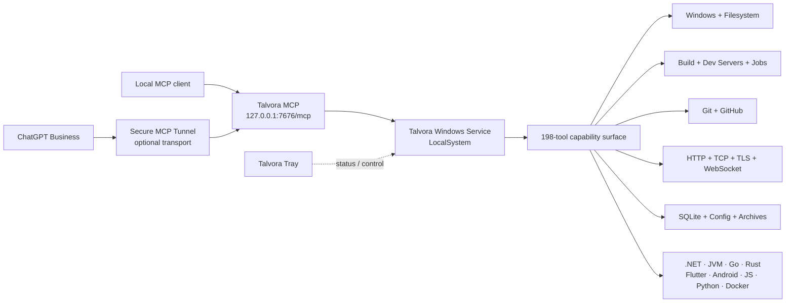
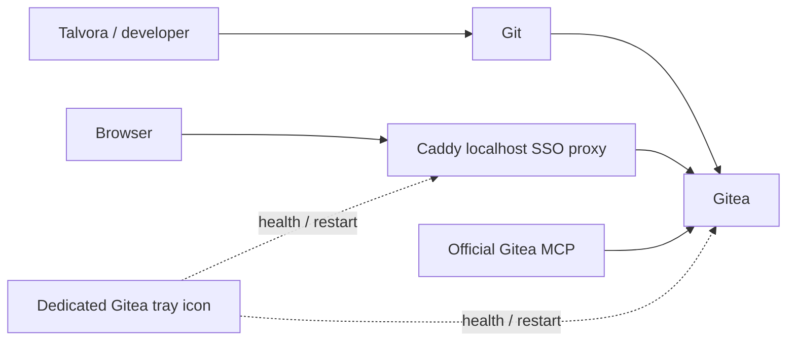

<p align="center">
  
</p>

<h1 align="center">Talvora MCP</h1>

<p align="center">
  <strong>A Windows-native, full-capability Model Context Protocol development environment.</strong><br />
  One local service. 198 structured tools. Real Windows control. No artificial capability walls.
</p>

<p align="center">
  <a href="https://github.com/bingoweb/Talvora-MCP/actions/workflows/windows-ci.yml"></a>
  
  
  
  
  
</p>

<p align="center">
  <a href="docs/ARCHITECTURE.md"><strong>Architecture</strong></a>
  ·
  <a href="docs/DEVELOPMENT-ENVIRONMENT.md"><strong>Development Environment</strong></a>
  ·
  <a href="APPLICATION-DEVELOPMENT-ROADMAP.md"><strong>Capability Roadmap</strong></a>
  ·
  <a href="BUG-AUDIT.md"><strong>Engineering Audit</strong></a>
</p>

---

## What is Talvora?

Talvora is a personal Windows development MCP built to let an AI coding client work with the machine as a real development environment instead of a narrow sandbox.

It runs as a single Windows Service under **LocalSystem**, exposes MCP on **loopback only**, and combines machine-readable development tools with unrestricted escape hatches for workflows that do not deserve a special wrapper.

> **Core idea:** model the common workflows cleanly, but never make the modelled surface the capability boundary.

| | |
| --- | --- |
| **Windows-native** | Services, processes, registry, Event Log, interactive sessions, Windows SDK, packaging and signing tools. |
| **198 MCP tools** | Filesystem, Git, builds, jobs, dev servers, networking, data, diagnostics, toolchains and release engineering. |
| **Full capability** | No Talvora path, command, host, repository, package, process or service allowlist is used as an artificial restriction layer. |
| **Developer-first** | Structured results, deterministic operations, persistent jobs, readiness probes, test summaries, diagnostics and artifact inventory. |
| **Modern toolchains** | .NET 10, JVM, Go, Rust, Flutter/Dart, Android, Node/npm/pnpm/Yarn/Bun, Python, Docker and Windows native tooling. |
| **Local-first** | Core MCP stays on `127.0.0.1`; ChatGPT Business can use the separate Secure MCP Tunnel transport when required. |

## Architecture



The runtime is intentionally simple: one canonical service, one canonical installer path, one canonical tool manifest, and a separate Tray UI for desktop status/control. See [the architecture document](docs/ARCHITECTURE.md) for the implementation-level view.

## Capability surface

### Windows & machine control

- Files, directories, hashes, byte/text I/O, search, patch, copy and move
- Processes, process trees, Windows Services and interactive user sessions
- Registry, environment variables and Windows Event Logs
- PowerShell and arbitrary executable launch
- TCP listeners/connections, DNS, ping and readiness waits

### Development orchestration

- Persistent background jobs with incremental stdout/stderr
- Long-running dev servers with TCP/HTTP readiness probes
- File-system watchers with queued change events
- HTTP mock/webhook listeners with capture and manual reply
- Workspace inspection, inferred commands and executable resolution
- Normalized diagnostics, coverage summaries and artifact inventory

### Build & language toolchains

| Ecosystem | First-class Talvora support |
| --- | --- |
| **.NET / Windows** | dotnet, Visual Studio discovery, MSBuild, Windows SDK, CMake, Ninja |
| **JVM** | Java, javac, Gradle, Maven |
| **Native** | Go, Rust, Cargo, rustup |
| **Mobile** | Flutter, Dart, Android SDK, ADB, emulator |
| **JavaScript** | Node.js, npm, pnpm, Yarn Modern, Bun |
| **Python** | Interpreter discovery, venv, pip, arbitrary Python execution |
| **Containers** | Docker, images, logs, exec and Compose |

Talvora's package-management rule on Windows is **Chocolatey**. WinGet is intentionally not part of the production/bootstrap path.

### Git, repositories & release engineering

Talvora has structured Git inspection plus unrestricted Git execution:

`talvora_git_info` · `talvora_git_status` · `talvora_git_diff` · `talvora_git_log` · `talvora_git_branches` · `talvora_git_run`

It also exposes GitHub CLI discovery/execution, Windows PE/version inspection and the Windows release toolchain including **SignTool, MakeAppx, MakePri, RC and MT**.

### Data, configuration & test assets

- SQLite query / execute / schema / online backup
- JSON, YAML, TOML, XML, INI and dotenv helpers
- ZIP archive create / inspect / extract
- HTTP downloads with resume and SHA-256
- TRX, JUnit/xUnit-style XML and NUnit test-report summaries
- Local knowledge `search` / `fetch` tools for ChatGPT company-knowledge style workflows

<details>
<summary><strong>Why both structured tools and raw execution?</strong></summary>

Structured tools make common operations easier to reason about and return stable machine-readable results. They are conveniences, not gates.

For anything outside the modelled surface, Talvora keeps direct capability available through tools such as:

- `talvora_run_process`
- `talvora_run_powershell`
- `talvora_git_run`
- `talvora_choco_run`
- `talvora_npm_run`
- `talvora_python_run`
- `talvora_docker_run`
- `talvora_gh_run`

This keeps the MCP ergonomic without silently reducing what the local development machine can do.

</details>

## Local Git stack

The current reference workstation also uses a local-first Git stack alongside Talvora:



The deployed integration currently uses **Gitea 1.27.3**, **Caddy 2.11.4** and the **official Gitea MCP 1.7.0**. Talvora's Tray exposes a separate Gitea status icon with healthy / degraded / stopped states and LocalSystem-backed restart control.

This companion stack is separate from the core Talvora MCP endpoint and does not turn GitHub into the primary local source-control dependency.

## Quick start

### 1. Install / rebuild Talvora

From an Administrator-capable Windows account:

```bat
TALVORA-KUR.cmd
```

The canonical build/install path produces a self-contained Windows runtime, installs the `Talvora` service and verifies the deployed MCP surface.

Local MCP endpoint:

```text
http://127.0.0.1:7676/mcp
```

### 2. Connect ChatGPT Business when needed

The core runtime does **not** require a public listener or an OpenAI API key. For ChatGPT Business, configure the separate Secure MCP Tunnel flow:

```bat
TALVORA-BUSINESS-KUR.cmd
```

The tunnel transports ChatGPT traffic to the loopback MCP while Talvora itself remains local-only.

## Engineering quality

Talvora treats the installed runtime as the truth, not just the source tree.

The Windows CI pipeline:

1. restores and builds the current projects,
2. parses PowerShell,
3. enforces the Chocolatey / no-WinGet production rule,
4. runs targeted source regressions,
5. boots the MCP and validates its canonical tool surface,
6. validates the ChatGPT Business bootstrap,
7. builds the canonical native installer,
8. installs the runtime as LocalSystem,
9. runs the MCP smoke suite against the installed build,
10. cleans the CI machine.

The current canonical manifest exposes **198 tools**. Runtime identity, installer provenance, tool count and deployed binaries are verified as part of the project's release discipline.

## Reference workstation

The current verified development environment includes:

- Windows SDK **10.0.28000.0**
- Temurin JDK **25.0.4.1 LTS**
- Flutter **3.47.5 stable**
- Dart **3.13.4 stable**
- pnpm **12.4.2**
- Yarn Modern **4.18.0**
- Bun **1.4.2**
- GitHub CLI **2.101.0**

See [Development Environment](docs/DEVELOPMENT-ENVIRONMENT.md) for the maintained toolchain notes.

## Project map

| Path | Purpose |
| --- | --- |
| `src/Talvora` | MCP service and application-development tools |
| `src/Talvora.Shared` | Shared runtime contracts and canonical tool manifest |
| `src/Talvora.Tray` | Windows tray UX, including Talvora and Gitea status surfaces |
| `src/Talvora.Installer` | Native canonical installer |
| `tests/Talvora.Smoke` | Exact MCP surface smoke validation |
| `scripts/Build-Windows-Installer.ps1` | Canonical package/build entry point |
| `docs/ARCHITECTURE.md` | Runtime and capability architecture |
| `docs/DEVELOPMENT-ENVIRONMENT.md` | Verified Windows development toolchain |
| `APPLICATION-DEVELOPMENT-ROADMAP.md` | Capability evolution and implementation status |
| `BUG-AUDIT.md` | Living engineering audit |
| `HANDOFF.md` | Single canonical development handoff |

## Design principles

- **Windows is a first-class target.**
- **Structured tools improve ergonomics; they do not define the capability ceiling.**
- **Modern supported technology wins over compatibility with deprecated tooling.**
- **Chocolatey is the Windows package manager for Talvora workflows.**
- **Runtime changes are not complete until the live installed service is updated and verified.**
- **One canonical installer, one canonical tool manifest, one canonical handoff.**
- **Test the changed area during development; reserve broad smoke validation for the exact deployed runtime.**

---

<p align="center">
  <strong>Talvora turns a Windows workstation into a first-class MCP development environment.</strong>
</p>
