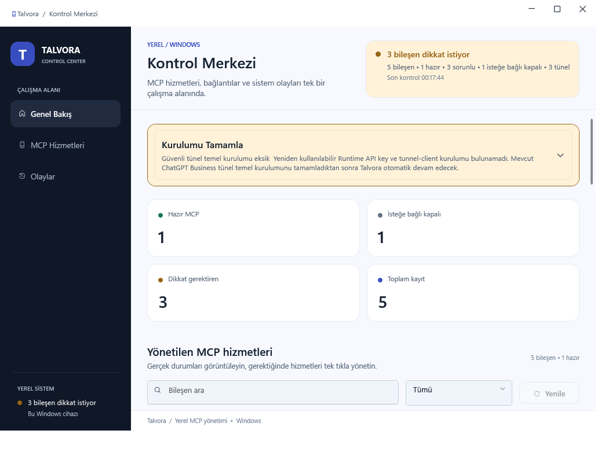

  

<h1 align="center">Talvora</h1>

  <strong>A Windows-native MCP runtime for serious local development and administration.</strong> 
  One service. Focused Dev/Admin surfaces. Transactional source editing. Persistent memory. A desktop Control Center that can actually diagnose and repair its managed components.

  
  
  
  
  

  <a href="docs/ARCHITECTURE.md">Architecture</a>
  ·
  <a href="docs/DEVELOPMENT-ENVIRONMENT.md">Development environment</a>
  ·
  <a href="docs/MODERNIZATION-POLICY.md">Engineering policy</a>
  ·
  <a href="SECURITY.md">Security & privacy</a>
  ·
  <a href="BUG-AUDIT.md">Engineering audit</a>

---

  

  Actual Talvora Control Center render from the current Windows build.

## Why Talvora exists

Talvora started from a practical problem: I wanted an AI coding client to work on a real Windows workstation as a development machine, not as a thin command wrapper and not as a pretend Linux sandbox.

That means dealing with the things Windows development actually involves: services, interactive user sessions, long-running processes, source edits, Git, SDKs, package managers, Event Log, registry, installers, local databases, desktop applications and repairable background infrastructure.

Talvora packages those workflows behind MCP without turning every operation into an opaque shell command. Common tasks have structured tools. Unusual tasks still have an escape hatch. The local runtime stays on loopback.

The project is deliberately opinionated:

- Windows is a first-class platform.
- One canonical Windows Service owns the runtime.
- One canonical installer owns deployment.
- Chocolatey is the Windows package manager.
- Structured tools improve reliability; they are not the capability ceiling.
- A change is not finished until the installed runtime is verified.

## Current system at a glance

| Area | Current implementation |
| --- | --- |
| **Runtime** | Windows Service, LocalSystem, loopback MCP on <code>127.0.0.1:7676</code> |
| **MCP surfaces** | Full: **240** tools · Dev: **203** · Admin: **84** · Shared: **47** |
| **Source editing** | Revision-aware transactional edits, WAL/receipt recovery, rollback, Roslyn and ast-grep specialists |
| **Control Center** | Native WPF desktop UI, live health, component lifecycle, event timeline, real diagnostic repair |
| **Memory** | SQLite + FTS5 + local multilingual semantic embeddings, automatic learning and handoff review |
| **Transport** | Local-first; ChatGPT Business uses optional Secure MCP Tunnel connections |
| **Integrations** | Gitea, Penpot, Modal, GitHub tooling, Windows toolchains and local developer infrastructure |
| **Release discipline** | Locked dependencies, source regressions, installer provenance and installed-runtime smoke verification |

> Talvora is high-capability software. The focused Dev/Admin endpoints improve discovery and tool selection; they are not security sandboxes. See [Security & Privacy](SECURITY.md) before exposing or redistributing the runtime.

## Architecture

~~~text
                          ChatGPT Business
                         /                \
                 Talvora Dev          Talvora Admin
                   203 tools             84 tools
                         \              /
                          Secure MCP Tunnel
                                 |
                                 v
Local MCP clients ------>  Talvora Windows Service
                            127.0.0.1:7676
                                 |
                  +--------------+--------------+
                  |              |              |
              /mcp           /mcp/dev       /mcp/admin
            240 tools        203 tools        84 tools
                  |
        +---------+----------+-----------+-----------+
        |                    |           |           |
   Source editing         Memory      Windows     Toolchains
   Git / builds / jobs    search      control     & integrations
        |
        +---- Control Center / Tray
              health · lifecycle · diagnostics · repair
~~~

The implementation keeps transport, capability and desktop management separate. The Windows Service is the canonical runtime. Dev/Admin are focused views over that same implementation. The Tray and Control Center observe and manage the runtime rather than replacing it.

See [docs/ARCHITECTURE.md](docs/ARCHITECTURE.md) for the implementation-level model.

## Focused MCP surfaces

Talvora exposes three local endpoints:

| Endpoint | Purpose | Tools |
| --- | --- | ---: |
| <code>/mcp</code> | Complete backwards-compatible capability surface | **240** |
| <code>/mcp/dev</code> | Development, source editing, builds, Git, jobs, Memory, Penpot and Modal workflows | **203** |
| <code>/mcp/admin</code> | Windows administration, services, registry, environment and machine management | **84** |

Dev and Admin share **47 reviewed tools** for diagnostics and common fallback operations. The overlap is explicit and regression-tested; it is not accidental duplication.

Examples of intentional role separation:

- package installation and persistent machine environment changes are Admin-oriented;
- long-running development jobs are Dev-oriented;
- read-only process/network/file diagnostics can be shared;
- the full <code>/mcp</code> endpoint preserves the complete tool set.

## Control Center

The Control Center is a native WPF desktop application, not a web dashboard bolted onto the service.

It provides:

- live health for Talvora Core, Talvora Dev, Talvora Admin and managed integrations;
- clear component roles instead of treating every connection as another service;
- start, stop and restart lifecycle actions;
- an event timeline and redacted raw-log view;
- a Memory Inspector with search, filtering, provenance and semantic-health controls;
- responsive desktop layout and keyboard/UI Automation support;
- visual smoke tests against the rendered WPF surface.

### Repair is diagnostic, not a renamed restart

The current repair path follows a simple rule:

~~~text
diagnose
   |
   v
repair the smallest failed layer
   |
   v
verify readiness
   |
   +---- ready ------> report success
   |
   +---- still broken
             |
             v
      controlled escalation
             |
             v
        verify again
~~~

For example, if a secure tunnel is down while the local MCP remains healthy, Talvora reconnects the tunnel instead of restarting the service. The same approach is used for the Gitea chain: backend, proxy, MCP process and tunnel can be repaired independently before a full-chain restart is considered.

Manual stop intent is preserved; automatic repair does not silently undo a user's explicit stop decision.

## Transactional source editing

Source editing is a first-class subsystem rather than a wrapper around <code>git apply</code>.

The normal workflow is:

~~~text
talvora_read_source
        |
        | revision
        v
talvora_apply_patch
        |
        +--> optimistic concurrency check
        +--> durable transaction / WAL
        +--> syntax validation
        +--> atomic commit
        +--> receipt / replay protection
        +--> rollback and recovery on failure
~~~

Specialist paths are available when the job calls for them:

- <code>talvora_apply_patch</code> — default repository editor;
- <code>talvora_apply_edits</code> — exact precomputed ranges;
- <code>talvora_structural_edit</code> — ast-grep structural transformations;
- <code>talvora_semantic_edit</code> — Roslyn symbol-aware C# edits.

The source-edit regression suite covers stale revisions, concurrent writers, crash recovery, WAL corruption, encoding/newline preservation, rollback, transaction replay and large-edit scenarios.

## Memory

Talvora Memory is local and built into the runtime.

Current capabilities include:

- SQLite-backed durable records;
- FTS5 lexical retrieval;
- local multilingual semantic search using a 384-dimensional MiniLM embedding model;
- hybrid ranking with source authority, confidence, importance and recency;
- project/scope/session/category filtering;
- stale-vector protection and resumable re-embedding;
- explicit decisions and automatic verified-recovery learning;
- duplicate/coalesced observations rather than uncontrolled memory growth;
- backup, staged restore and pre-restore safety backup;
- Control Center Memory Inspector;
- read-only handoff candidate/review tools for project continuity.

The embedding model is shipped locally with pinned provenance and hashes. Memory search falls back to lexical retrieval when semantic embedding is unavailable.

## Developer and machine tooling

Talvora covers the workflows I actually use on Windows rather than trying to hide them behind one generic executor.

| Area | Examples |
| --- | --- |
| **.NET / Windows** | dotnet, MSBuild, Visual Studio discovery, Windows SDK, CMake, Ninja, SignTool, MakeAppx, MakePri, RC, MT |
| **Git / GitHub** | status, diff, log, branches, generic Git execution, GitHub CLI |
| **JavaScript** | Node.js, npm, pnpm, Yarn Modern, Bun |
| **Python** | interpreter discovery, venv, pip and general execution |
| **JVM** | Java, javac, Gradle, Maven |
| **Native** | Go, Rust, Cargo, rustup |
| **Mobile** | Flutter, Dart, Android SDK, ADB, emulator |
| **Containers** | Docker, images, logs, exec and Compose |
| **Windows** | processes, services, registry, environment, Event Log, interactive sessions |
| **Networking** | DNS, ping, TCP listeners/connections, TLS inspection, HTTP and readiness checks |
| **Data/config** | SQLite, JSON, YAML, TOML, XML, INI, dotenv and archives |

Chocolatey is the only Windows package manager used by the production/bootstrap path. WinGet is intentionally excluded.

## Integrations

### Gitea

The reference workstation uses a local Gitea stack alongside GitHub:

~~~text
Git / Talvora
     |
     v
   Gitea ---- Caddy
     |
 Official Gitea MCP
     |
 Secure MCP Tunnel
~~~

The Control Center tracks the chain end-to-end and can repair the failed layer without blindly restarting healthy services.

### Penpot

Talvora integrates with a self-hosted Penpot environment and its local MCP bridge. The Dev surface includes Penpot status, overview, safe read and generic call wrappers. A Talvora AI plugin is served directly by the Talvora Windows Service for local design workflows.

### Modal

The Dev surface includes native Modal CLI/app/endpoint tools and supports locally managed deployment workflows without introducing a second general-purpose MCP layer.

### ChatGPT Business

ChatGPT Business connectivity is optional. Talvora itself remains loopback-only.

The Business setup uses OpenAI Secure MCP Tunnel to attach the focused Dev/Admin endpoints without exposing a public Talvora listener.

## Quick start

### Requirements

- Windows 10 or Windows 11, x64
- Administrator-capable account for installation
- .NET SDK pinned by <code>global.json</code> for development builds
- Chocolatey for Windows package management

### Install or rebuild

Run from the repository root:

~~~bat
TALVORA-KUR.cmd
~~~

The canonical installer publishes the runtime, installs the Windows Service, updates the Tray/Control Center and verifies the deployed MCP surface.

Health endpoint:

~~~text
http://127.0.0.1:7676/healthz
~~~

MCP endpoints:

~~~text
http://127.0.0.1:7676/mcp
http://127.0.0.1:7676/mcp/dev
http://127.0.0.1:7676/mcp/admin
~~~

### Optional ChatGPT Business connection

~~~bat
TALVORA-BUSINESS-KUR.cmd
~~~

Talvora does not require an OpenAI API key to run locally. The Business tunnel credential belongs to the transport layer and is stored separately from the Talvora runtime.

## Engineering quality

The repository is built around the installed runtime, not around the assumption that a successful compile means the product works.

The Windows CI pipeline verifies, among other things:

1. locked dependency restore;
2. Release build;
3. PowerShell syntax;
4. Chocolatey / no-WinGet policy;
5. Context7 + vendor-documentation quality gate;
6. focused source regressions;
7. live MCP surface policy;
8. ChatGPT Business bootstrap self-test;
9. canonical native installer creation;
10. LocalSystem installation and health verification;
11. installed-runtime MCP smoke tests.

Local release work goes further where a hosted runner cannot reproduce an interactive Windows desktop session: Control Center WPF visual smoke, focused Business connection probes, installer identity checks and targeted live acceptance tests are run against the installed build.

## Security and trust model

Talvora is intentionally powerful.

- The MCP listener binds to loopback by default.
- The Windows Service runs as LocalSystem.
- Focused Dev/Admin endpoints are discovery boundaries, not privilege sandboxes.
- Persistent logs redact common credential forms.
- Business tunnel credentials are kept separate from the runtime and protected in the interactive user context.
- Public documentation must not contain live secrets, private keys or machine-specific credentials.
- General-purpose process and PowerShell tools remain available by design.

If you are evaluating or redistributing Talvora, read [SECURITY.md](SECURITY.md) first.

## Repository map

| Path | Purpose |
| --- | --- |
| <code>src/Talvora</code> | MCP host and application/development tool implementations |
| <code>src/Talvora.Shared</code> | shared contracts, focused-surface policy and canonical tool manifest |
| <code>src/Talvora.Tray</code> | Tray, Control Center, repair/recovery and desktop UX |
| <code>src/Talvora.Installer</code> | canonical native Windows installer |
| <code>tests/Talvora.Smoke</code> | MCP surface and installed-runtime smoke validation |
| <code>tests/Talvora.SourceEdit.Regression</code> | transactional source-edit regression suite |
| <code>scripts</code> | installer, bootstrap, verification and operational scripts |
| <code>docs</code> | architecture, development environment and engineering policy |
| <code>HANDOFF.md</code> | canonical project handoff |
| <code>BUG-AUDIT.md</code> | living engineering audit |

## Design decisions

A few project choices are deliberate and unlikely to change casually:

- **Windows-native over cross-platform abstraction.**
- **One service over a collection of hidden helper daemons.**
- **Local-first over public ingress.**
- **Chocolatey over multiple Windows package-manager paths.**
- **Structured operations first, general execution still available.**
- **Minimal repair before restart.**
- **Exact installed-runtime verification before calling work complete.**

## Documentation

- [Architecture](docs/ARCHITECTURE.md)
- [Development environment](docs/DEVELOPMENT-ENVIRONMENT.md)
- [Modernization policy](docs/MODERNIZATION-POLICY.md)
- [Security & privacy](SECURITY.md)
- [Application-development roadmap](APPLICATION-DEVELOPMENT-ROADMAP.md)
- [Source Edit architecture](SOURCE-EDIT-ENGINE-ARCHITECTURE.md)
- [Engineering audit](BUG-AUDIT.md)

---

  <strong>Talvora is built for a real Windows workstation: local, inspectable, repairable and explicit about what it can do.</strong>

